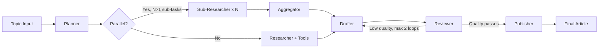

[](https://multi-agent-demo-xjvogxpydrv6cfnxvqftpx.streamlit.app)

# Multi-Agent Orchestrator Demo

Live demo of a production-grade multi-agent content pipeline: **planning**, **tool use**, **RAG retrieval**, and **conditional routing** via LangGraph. Runs fully offline with MockLLM.

> **Proof in 30 seconds** -- planning | routing | tool use | live demo without API keys
>
> **Best fit** -- AI Engineer, LLM Engineer
>
> **Why it matters** -- Easiest repo in the flagship set for a hiring manager to evaluate quickly and understand orchestration patterns.

## For Hiring Managers

| If you're hiring for... | This repo demonstrates |
|---|---|
| **AI/LLM Engineer** | LangGraph state machines, multi-agent orchestration, conditional routing, tool use, RAG retrieval, planning agents |
| **Python Engineer** | 89 tests, async patterns, MockLLM for offline testing, multi-provider LLM support (Claude, OpenAI, Zhipu AI) |
| **MLOps Engineer** | CI/CD pipeline with 70% coverage gate, per-agent model routing, parallel fan-out execution |

**Key metrics:** 94 tests, 7-node pipeline, live Streamlit demo, Trace Inspector tab (3 sample runs), runs without API keys (MockLLM), multi-provider support

### Trace Inspector (new)

Open the Streamlit sidebar and pick **Trace Inspector** to audit a recent agent run end to end. Each run shows:

- Per-span timeline: agent, tool called, input snippet, output snippet, latency, tokens, cost
- Run-level rollups: outcome, total latency, total tokens, total cost, revision count
- 3 pre-recorded runs covering the three outcomes a reviewer cares about:
  1. `run-001-success`: clean 6-span pipeline, 4.8 s, $0.00412
  2. `run-002-retry-then-success`: reviewer triggers one revision loop, 7.2 s, $0.00693
  3. `run-003-tool-failure`: `web_search` times out, researcher surfaces failure cleanly, 3.1 s, $0.00184

Source: `data/sample_traces.json`. Schema is asserted by `tests/test_trace_inspector.py` (5 tests). This is the MVP; next iteration wires the same UI to live SQLite + Langfuse so every demo run produces a fresh trace.

**Certifications applied:** IBM RAG and Agentic AI (24h, LangGraph state machines), Duke LLMOps (48h, CI/CD pipeline patterns)

---

> Built using patterns from IBM RAG & Agentic AI (LangGraph state machines, tool-augmented agents) and Duke LLMOps (CI/CD pipeline, deployment patterns). See `orchestrator/` for parallel fan-out implementation. The `mesh/` package contains a scaffold `MeshCoordinator` distilled from EnterpriseHub; it is not yet wired into the graph (see [#wire-mesh-coordinator](#wire-mesh-coordinator)).

## Architecture



> Orchestration: LangGraph StateGraph -- conditional routing + Send() fan-out

**5 nodes, 2 conditional edges, tool use, planning pre-pass:**
- **Planner** decomposes complex topics into research sub-tasks (LangGraph conditional entry)
- **Researcher** calls `web_search` + `retrieve_docs` tools before generating response
- **Drafter → Reviewer → Drafter** revision loop (conditional routing, max 2 passes)
- **Mesh Coordinator** tracks agent health, tokens, latency, and cost
- **MockToolProvider** / **MockLLM** - fully runnable without any API keys

## Quick Start

```bash
pip install -e ".[dev]"

# Run tests (89 passing)
pytest tests/ -x -q

# Launch Streamlit demo (no API key needed)
streamlit run demo/app.py

# With real Claude + tools
ANTHROPIC_API_KEY=sk-... streamlit run demo/app.py

# With GLM-4 Plus (Zhipu AI, OpenAI-compatible) - see demo/mock_llm.py for swap instructions
ZHIPUAI_API_KEY=... streamlit run demo/app.py

# Enable optional ChromaDB vector store
pip install -e ".[rag]"
```

## Key Features

| Feature | Pattern | File |
|---------|---------|------|
| Tool-using research agent | `web_search` + `retrieve_docs` w/ Pydantic schemas | `orchestrator/tools.py` |
| Planning agent | Topic decomposition → numbered sub-tasks | `orchestrator/planner.py` |
| Conditional entry routing | `START -> planner OR researcher` | `orchestrator/graph.py` |
| Revision loop | Reviewer routes back to drafter if score < 0.7 | `orchestrator/graph.py` |
| Grounded research | Tool results injected into researcher prompt | `orchestrator/nodes.py` |
| Agent registry scaffold (not wired) | Per-agent metric structs with heartbeat fields | `mesh/coordinator.py` |

## Project Structure

```
orchestrator/
    graph.py        # LangGraph state machine (planner + tools + parallel + revision)
    nodes.py        # Agent node functions (research, sub_researcher, aggregator, …)
    planner.py      # Planner node + should_plan() heuristic
    state.py        # TypedDict state (PipelineState, ToolCall, AgentOutput)
    tools.py        # Tool definitions + MockToolProvider (wired to vector store)
    vectorstore.py  # MockVectorStore (TF-IDF, no deps) + ChromaVectorStore (optional)
mesh/
    coordinator.py # Scaffold coordinator (health, cost, routing) - NOT wired into graph
    registry.py    # Agent registry and metrics
demo/
    app.py         # Streamlit UI
    mock_llm.py    # Mock + real LLM providers
tests/
    test_graph.py         # Pipeline state machine tests (13 tests)
    test_coordinator.py   # Coordinator and registry tests (20 tests)
    test_tools.py         # Tool execution + research_node integration (22 tests)
    test_planner.py       # Planner node + conditional routing (17 tests)
    test_parallel.py      # Parallel fan-out/fan-in via Send() (7 tests)
    test_vectorstore.py   # MockVectorStore + ChromaVectorStore integration (10 tests)
```

## Supported LLM Providers

| Provider | Model | Env Var | Notes |
|----------|-------|---------|-------|
| Anthropic (default) | `claude-haiku-4-5-20251001` | `ANTHROPIC_API_KEY` | Used when key is set; falls back to MockLLM |
| Zhipu AI | `glm-4-plus` | `ZHIPUAI_API_KEY` | OpenAI-compatible API (`https://open.bigmodel.cn/api/paas/v4/`) |
| Zhipu AI (fast) | `glm-4-flash` | `ZHIPUAI_API_KEY` | Cheaper/faster GLM variant |
| OpenAI | `gpt-4.1` | `OPENAI_API_KEY` | Drop-in via `openai.AsyncOpenAI` |

See `demo/mock_llm.py` for provider swap instructions.

## Key Design Decisions

1. **Tool use is backward-compatible**: `research_node` works with or without `tool_provider`
2. **Planning is opt-in**: `ContentPipeline(use_planner=True)` - off by default, no breaking changes
3. **Deterministic mocks**: `MockToolProvider` and `MockLLM` produce consistent outputs for CI
4. **Same LangGraph patterns as EnterpriseHub**: TypedDict state, conditional edges, `ainvoke()`

## Known scope gaps

<a id="wire-mesh-coordinator"></a>
- **MeshCoordinator is scaffold only.** `mesh/coordinator.py` and `mesh/registry.py` are distilled from EnterpriseHub's AgentMeshCoordinator and have their own 20-test suite, but `start_agent()` / `complete_agent()` are not called from `orchestrator/graph.py`. Cost figures shown in the Streamlit UI come from the LLM provider response, not from MeshCoordinator. TODO: either wire it into each node in `ContentPipeline` or remove it. Tracked alongside the trace-export work in `~/Projects/_hero_repo_specs/multi-agent-demo.md`.
- **Review score is a length heuristic.** `orchestrator/nodes.py` review_node returns 0.85 when draft length > 100 and revision_count >= 1, rather than scoring with a calibrated judge. The routing decision in `graph.py` (score >= 0.7) therefore does not use the Claude reviewer output. Replacing this with a calibrated judge is tracked in the hero spec.
- **No external trace export.** Observability is `logging.info` only. No LangSmith / Langfuse / Phoenix / OpenTelemetry export yet.

## License

MIT - see [LICENSE](LICENSE) for details.
