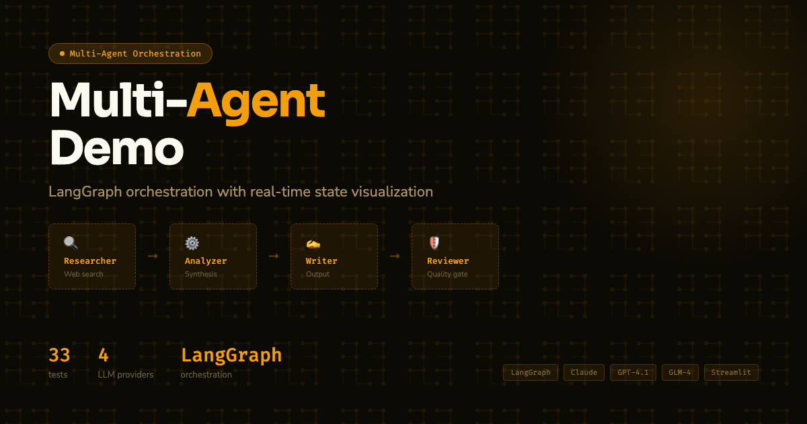

[](https://multi-agent-demo-xjvogxpydrv6cfnxvqftpx.streamlit.app)

# Multi-Agent Orchestrator Demo

Live demo of a production-grade multi-agent content pipeline: **planning**, **tool use**, **RAG retrieval**, and **conditional routing** via LangGraph. Runs fully offline with MockLLM.

> Built using patterns from IBM RAG & Agentic AI (LangGraph state machines, tool-augmented agents) and Duke LLMOps (CI/CD pipeline, deployment patterns). See `orchestrator/` for parallel fan-out implementation and `mesh/` for MeshCoordinator cost tracking.

## Architecture

```
Topic Input
    |
    v
[Planner] ---(complex topics only)---+
    |                                 |
    v                                 |
[use_parallel & N>1 sub-tasks?]      |
  YES → [Sub-Research x N]           |
         → [Aggregator]              |
  NO  → [Researcher + Tools] <-------+
           - web_search(query)
           - retrieve_docs(query)   <- vector store retrieval
    |
    v
[Drafter] --> [Reviewer] ---(low quality)--> [Drafter] (max 2 loops)
                   |
                   v (quality passes)
             [Publisher]
                   |
                   v
            Final Article

Orchestration: LangGraph StateGraph — conditional routing + Send() fan-out
```

**5 nodes, 2 conditional edges, tool use, planning pre-pass:**
- **Planner** decomposes complex topics into research sub-tasks (LangGraph conditional entry)
- **Researcher** calls `web_search` + `retrieve_docs` tools before generating response
- **Drafter → Reviewer → Drafter** revision loop (conditional routing, max 2 passes)
- **Mesh Coordinator** tracks agent health, tokens, latency, and cost
- **MockToolProvider** / **MockLLM** — fully runnable without any API keys

## Quick Start

```bash
pip install -e ".[dev]"

# Run tests (89 passing)
pytest tests/ -x -q

# Launch Streamlit demo (no API key needed)
streamlit run demo/app.py

# With real Claude + tools
ANTHROPIC_API_KEY=sk-... streamlit run demo/app.py

# With GLM-4 Plus (Zhipu AI, OpenAI-compatible) — see demo/mock_llm.py for swap instructions
ZHIPUAI_API_KEY=... streamlit run demo/app.py

# Enable optional ChromaDB vector store
pip install -e ".[rag]"
```

## Key Features

| Feature | Pattern | File |
|---------|---------|------|
| Tool-using research agent | `web_search` + `retrieve_docs` w/ Pydantic schemas | `orchestrator/tools.py` |
| Planning agent | Topic decomposition → numbered sub-tasks | `orchestrator/planner.py` |
| Conditional entry routing | `START -> planner OR researcher` | `orchestrator/graph.py` |
| Revision loop | Reviewer routes back to drafter if score < 0.7 | `orchestrator/graph.py` |
| Grounded research | Tool results injected into researcher prompt | `orchestrator/nodes.py` |
| Agent health/cost mesh | Per-agent metrics with heartbeat health checks | `mesh/coordinator.py` |

## Project Structure

```
orchestrator/
    graph.py        # LangGraph state machine (planner + tools + parallel + revision)
    nodes.py        # Agent node functions (research, sub_researcher, aggregator, …)
    planner.py      # Planner node + should_plan() heuristic
    state.py        # TypedDict state (PipelineState, ToolCall, AgentOutput)
    tools.py        # Tool definitions + MockToolProvider (wired to vector store)
    vectorstore.py  # MockVectorStore (TF-IDF, no deps) + ChromaVectorStore (optional)
mesh/
    coordinator.py # Mesh coordinator (health, cost, routing)
    registry.py    # Agent registry and metrics
demo/
    app.py         # Streamlit UI
    mock_llm.py    # Mock + real LLM providers
tests/
    test_graph.py         # Pipeline state machine tests (13 tests)
    test_coordinator.py   # Coordinator and registry tests (20 tests)
    test_tools.py         # Tool execution + research_node integration (22 tests)
    test_planner.py       # Planner node + conditional routing (17 tests)
    test_parallel.py      # Parallel fan-out/fan-in via Send() (7 tests)
    test_vectorstore.py   # MockVectorStore + ChromaVectorStore integration (10 tests)
```

## Supported LLM Providers

| Provider | Model | Env Var | Notes |
|----------|-------|---------|-------|
| Anthropic (default) | `claude-haiku-4-5-20251001` | `ANTHROPIC_API_KEY` | Used when key is set; falls back to MockLLM |
| Zhipu AI | `glm-4-plus` | `ZHIPUAI_API_KEY` | OpenAI-compatible API (`https://open.bigmodel.cn/api/paas/v4/`) |
| Zhipu AI (fast) | `glm-4-flash` | `ZHIPUAI_API_KEY` | Cheaper/faster GLM variant |
| OpenAI | `gpt-4.1` | `OPENAI_API_KEY` | Drop-in via `openai.AsyncOpenAI` |

See `demo/mock_llm.py` for provider swap instructions.

## Key Design Decisions

1. **Tool use is backward-compatible**: `research_node` works with or without `tool_provider`
2. **Planning is opt-in**: `ContentPipeline(use_planner=True)` — off by default, no breaking changes
3. **Deterministic mocks**: `MockToolProvider` and `MockLLM` produce consistent outputs for CI
4. **Same LangGraph patterns as EnterpriseHub**: TypedDict state, conditional edges, `ainvoke()`

## License

MIT — see [LICENSE](LICENSE) for details.
